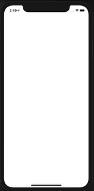

# iOS app using CoreLocation and MapKit 

It calculates distance from current location to nearest restaurants and 
displays them in an tableview. 
It shows a map with the path towards the destination from current location 
It shows a map with a cluster of restaurants that the user can tap on to view details.

